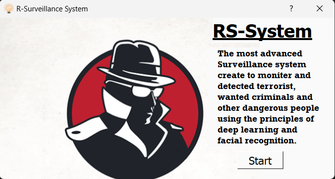
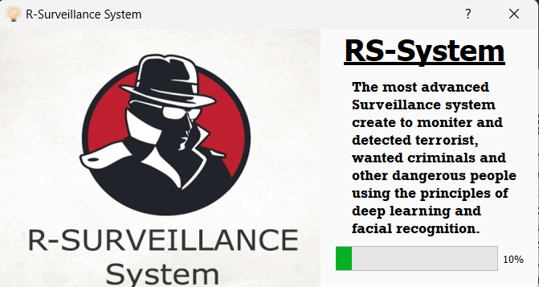
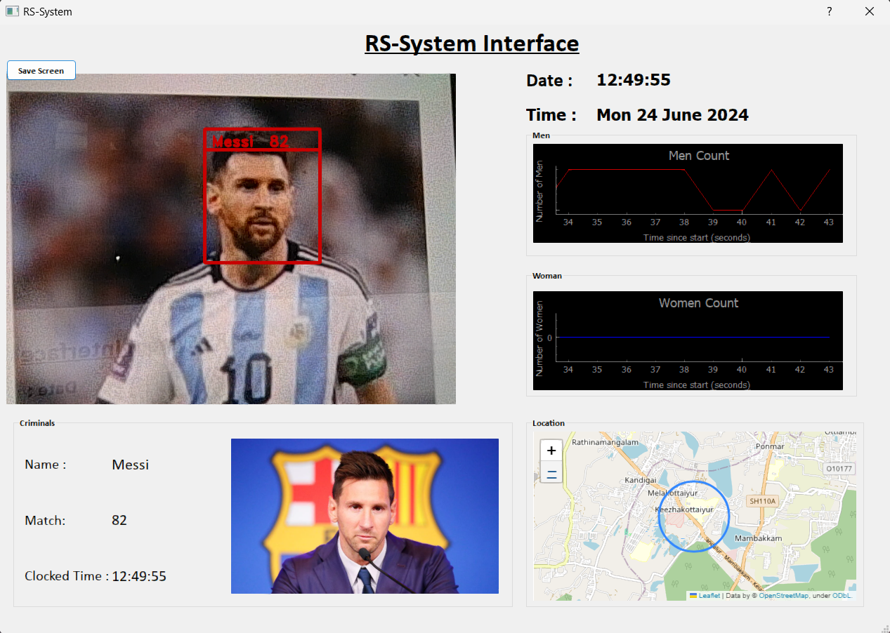

# Face-Detection-and-Recognition-using-PYQT-Interface

## Overview
Face-Detection-and-Recognition-using-PYQT-Interface is an advanced application designed for real-time face detection and recognition using PyQt GUI framework. This project leverages state-of-the-art deep learning techniques to achieve high accuracy and performance. With an accuracy of 98% and minimal latency, it proves to be a reliable solution for applications requiring robust face detection and recognition capabilities.

## Key Features
1. Real-time Face Detection: Utilizes efficient algorithms for detecting faces in real-time video streams or static images.
2. Face Recognition: Employs deep learning models to recognize faces based on pre-trained embeddings, allowing for identification of known individuals.
3. PYQT Interface: Offers a user-friendly GUI interface built with PyQt, enabling easy interaction and integration into diverse applications.
4. High Accuracy: Achieves an impressive accuracy of 98% in face detection and recognition tasks, validated through comprehensive testing on benchmark datasets.
5. Low Latency: Performs efficiently with minimal delay, suitable for real-time applications such as surveillance systems and interactive interfaces.

## Output

